```{r xaringanExtra-clipboard, echo=FALSE}
htmltools::tagList(
  xaringanExtra::use_clipboard(
    button_text = "<i class=\"fa fa-clipboard\"></i>",
    success_text = "<i class=\"fa fa-check\" style=\"color: #90BE6D\"></i>",
  ),
  rmarkdown::html_dependency_font_awesome()
)
```

```{r setup, include=FALSE}

options(htmltools.dir.version = FALSE)

knitr::opts_chunk$set(
  echo=FALSE,
  warning = FALSE,
  message = FALSE,
  fig.width=12, 
  fig.height=6, 
  dpi=72*5,
  cache = TRUE
)

library(tidymodels)
library(survival)
library(glue)
library(gridExtra)
library(knitr)
library(kableExtra)
library(scales)
library(widgetframe)
library(magrittr)
library(tidyverse)
library(plotly)
library(palmerpenguins)
library(ggforce)
library(party)
library(rpart)
library(rpart.plot)
library(parttree)
library(ranger)
library(obliqueRF)
library(aorsf)

print_plotly <- function(x){
 
 x %>% 
  layout(
   xaxis = list(range = list(-3.1, 3.1),
                showgrid = FALSE,
                zerolinecolor = 'white',
                titlefont = list(size = 20),
                title = '<b>Bill length, scaled</b>',
                tickvals = list(-3, -2, -1, 0, 1, 2, 3)),
   yaxis = list(range = list(-2.1, 2.1),
                showgrid = FALSE,
                zerolinecolor = 'white',
                titlefont = list(size = 20),
                title = '<b>Bill depth, scaled</b>',
                tickvals = list(-2, -1, 0, 1, 2))
  ) %>% 
  config(displayModeBar = FALSE) %>% 
  style(hoverinfo = 'none') %>% 
  hide_legend()
 
}

plotly_height <- 450
plotly_width <- 750
cols <- c("darkorange", "purple", "cyan4")

```

class: center, middle

# Hello!

## Slides are here: https://www.byronjaeger.com/talk/

---

# Outline

**Background and Jargon**

- Machine Learning & Supervised Learning

- Decision Trees & Random Forests: Axis-based & Oblique

- Censoring & Random Survival Forests 

- Oblique Random Survival Forests 

**Demo with `aorsf`**

- Fit

- Interpret

- Benchmark

- Extend

---
background-image: url(img/data_mining.jpg)
background-size: 15%
background-position: 95% 5%

# Machine Learning

.pull-left[

### Supervised learning

- Labeled data

- Predict an outcome

- Learners

- Risk prediction

]

.pull-right[

### Unsupervised learning

- Unlabeled data

- Find structure

- Clusters

- Organize medical records

]

---
class: center, middle

# Supervised learning

---

```{r out.width='75%', echo=FALSE, fig.align='center'}
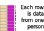
```


---


```{r out.width='75%', echo=FALSE, fig.align='center'}
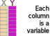
```

---

```{r out.width='75%', echo=FALSE, fig.align='center'}
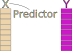
```

---

```{r out.width='75%', echo=FALSE, fig.align='center'}
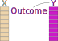
```

---

```{r out.width='75%', echo=FALSE, fig.align='center'}
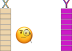
```

---

```{r out.width='75%', echo=FALSE, fig.align='center'}
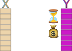
```

---

```{r out.width='75%', echo=FALSE, fig.align='center'}
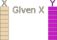
```

---

```{r out.width='75%', echo=FALSE, fig.align='center'}
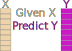
```

---

```{r out.width='75%', echo=FALSE, fig.align='center'}
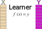
```

---
layout: false
class: center, middle, inverse

# Decision Trees and Random Forests

---
background-image: url(img/penguins.png)
background-size: 45%
background-position: 85% 72.5%

## Decision trees

- Partition the space of predictor variables.

- Used in classification, regression, and survival analysis. 

- May be **axis-based** or **oblique** (more on this soon)

.pull-left[
We'll demonstrate the mechanics of decision trees by developing a prediction rule to classify penguin<sup>1</sup> species (chinstrap, gentoo, or adelie) based on bill depth and bill length.
]

.footnote[
<sup>1</sup>Data were collected and made available by [Dr. Kristen Gorman](https://www.uaf.edu/cfos/people/faculty/detail/kristen-gorman.php) and the [Palmer Station](https://pal.lternet.edu/), a member of the [Long Term Ecological Research Network](https://lternet.edu/).
]

---

```{r, echo=FALSE, message=FALSE}

library(palmerpenguins)
library(tidyverse)

penguins_scaled <- 
  drop_na(penguins, bill_length_mm, flipper_length_mm)

```


Dimensions for Adelie, Chinstrap and Gentoo Penguins at Palmer Station

```{r fig.align='center'}

ylim = c(30, 65)
xlim = c(170, 235)


ggplot(data = penguins_scaled) +
  aes(x = flipper_length_mm, 
      y = bill_length_mm, 
      label = species) +
  geom_point(aes(color = species, shape = species),
             size = 3,
             alpha = 0.8) +
  geom_mark_ellipse(aes(color = species, fill = species), 
                    alpha = 0.075) +
  theme_minimal() +
  scale_color_manual(values = cols) +
  scale_fill_manual(values = cols) +
  labs(x = "\nFlipper length, mm",
       y = "\nBill length, mm\n") +
  coord_cartesian(ylim = ylim,
                  xlim = xlim) +
  theme(panel.grid = element_blank(),
        legend.position = '',
        text = element_text(size=13, face = 'bold'))

```

---

Partition all the penguins into flipper length < 207 or ≥ 207

```{r fig.align='center'}

mdl_tree <- rpart(formula = species ~ flipper_length_mm + bill_length_mm,
                  data = penguins_scaled, 
                  control = rpart.control(maxdepth = 1))

ggplot(data = penguins_scaled) +
  aes(x = flipper_length_mm, 
      y = bill_length_mm, 
      label = species) +
  geom_point(aes(color = species, shape = species),
             size = 3,
             alpha = 0.8) +
  geom_parttree(data = mdl_tree, aes(fill=species), alpha = 0.1) +
  theme_minimal() +
  scale_color_manual(values = cols) +
  scale_fill_manual(values = cols[c(1,3)]) +
  labs(x = "\nFlipper length, mm",
       y = "\nBill length, mm\n") +
  coord_cartesian(ylim = ylim,
                  xlim = xlim) +
  theme(panel.grid = element_blank(),
        legend.position = '',
        text = element_text(size=13, face = 'bold'))
```

---

Partition penguins on the left into bill length < 43 or ≥ 43

```{r fig.align='center'}

mdl_tree <- rpart(formula = species ~ flipper_length_mm + bill_length_mm,
                  data = penguins_scaled, 
                  control = rpart.control(maxdepth = 2))

ggplot(data = penguins_scaled) +
   aes(x = flipper_length_mm, 
      y = bill_length_mm, 
      label = species)  +
  geom_point(aes(color = species, shape = species),
             size = 3,
             alpha = 0.8) +
  geom_parttree(data = mdl_tree, aes(fill=species), alpha = 0.1) +
  theme_minimal() +
  scale_color_manual(values = cols) +
  scale_fill_manual(values = cols) +
  labs(x = "\nFlipper length, mm",
       y = "\nBill length, mm\n") +
  coord_cartesian(ylim = ylim,
                  xlim = xlim) +
  theme(panel.grid = element_blank(),
        legend.position = '',
        text = element_text(size=13, face = 'bold'))

```

---

The same partitions visualized as a binary tree

```{r, fig.width=8, fig.height=4}

rpart.plot(mdl_tree,
           type = 5,
           extra = 4,
           box.palette = list("darkorange","purple","cyan4"))

```

---

## Random Forest

Each tree is grown through a randomized process:

- tree-specific bootstrapped replicate of the training data

- node-specific random subsets of predictors

Randomness makes the trees more independent

- Each randomized tree is *individually weaker* than a standard decision tree.

- The *average prediction* from many randomized trees is more accurate than the prediction from a single tree.

Why? Consider 100 classification trees, each with 55% chance of choosing the right answer, 45% chance of choosing wrong.

- if the trees are all the same, the ensemble has 45% chance of being wrong
    
- if they are completely independent and we use the majority vote:
    
  ```{r, echo = TRUE}
  
  # chance of 49 or fewer trees being right
  pbinom(q = 49, size = 100, prob = 0.55)
  
  ```


```{r, forest-plot-prep, cache=TRUE, include=FALSE}


set.seed(32987)

mdl_tree_nonrandom <- ranger(
 formula = species ~ flipper_length_mm + bill_length_mm, 
 data = penguins_scaled,
 probability = TRUE,
 num.trees = 1, 
 max.depth = 2,
 mtry = 2,
 replace = FALSE,
 sample.fraction = 1
)

mdl_tree <- ranger(
 formula = species ~ flipper_length_mm + bill_length_mm, 
 data = penguins_scaled,
 probability = TRUE,
 num.trees = 1
)

mdl_forest <- ranger(
 formula = species ~ flipper_length_mm + bill_length_mm, 
 data = penguins_scaled,
 probability = TRUE,
 num.trees = 1000
)

grid <- expand_grid(
 flipper_length_mm = seq(xlim[1], xlim[2], len = 200),
 bill_length_mm = seq(ylim[1], ylim[2], len = 200)
) %>% 
  mutate(flipper_length_rev = rev(flipper_length_mm),
         bill_length_rev = rev(bill_length_mm))

pred_one_tree <- predict(mdl_tree, data = grid) %>% 
  getElement('predictions') %>% 
  as_tibble()

pred_nonrandom <- predict(mdl_tree_nonrandom, data = grid) %>% 
  getElement('predictions') %>% 
  as_tibble()

pred_forest <- predict(mdl_forest, data = grid) %>% 
  getElement('predictions') %>% 
  as_tibble() 

mdl_oblique_1 <- obliqueRF(
  x = as.matrix(penguins_scaled[, c('flipper_length_mm', 'bill_length_mm')]),
  y = as.matrix(as.numeric(penguins_scaled$species == 'Chinstrap')), 
  ntree = 100,
  mtry = 2
)

tree_oblique_1 <- mdl_oblique_1
tree_oblique_1$trees <- mdl_oblique_1$trees[1]
tree_oblique_1$ntree <- 1


mdl_oblique_2 <- obliqueRF(
  x = as.matrix(penguins_scaled[, c('flipper_length_mm', 'bill_length_mm')]),
  y = as.matrix(as.numeric(penguins_scaled$species == 'Adelie')), 
  ntree = 100,
  mtry = 2
)

tree_oblique_2 <- mdl_oblique_2
tree_oblique_2$trees <- mdl_oblique_2$trees[1]
tree_oblique_2$ntree <- 1


mdl_oblique_3 <- obliqueRF(
  x = as.matrix(penguins_scaled[, c('flipper_length_mm', 'bill_length_mm')]),
  y = as.matrix(as.numeric(penguins_scaled$species == 'Gentoo')), 
  ntree = 100,
  mtry = 2
)

tree_oblique_3 <- mdl_oblique_3
tree_oblique_3$trees <- mdl_oblique_3$trees[1]
tree_oblique_3$ntree <- 1

pred_oblique_forest <- list(
  Chinstrap = mdl_oblique_1,
  Adelie = mdl_oblique_2,
  Gentoo = mdl_oblique_3
) %>% 
  map(~ predict(.x, newdata = as.matrix(grid), type = 'prob')[, 2]) %>% 
  as_tibble()

pred_oblique_tree <- list(
  Chinstrap = tree_oblique_1,
  Adelie = tree_oblique_2,
  Gentoo = tree_oblique_3
) %>% 
  map(~ predict(.x, newdata = as.matrix(grid), type = 'prob')[, 2]) %>% 
  as_tibble()


grid_plots <- list(
  tree_nonrandom = pred_nonrandom,
  tree = pred_one_tree,
  tree_oblique = pred_oblique_tree,
  forest = pred_forest,
  forest_oblique = pred_oblique_forest
) %>% 
  map(
    ~ bind_cols(grid, .x) %>% 
      pivot_longer(cols = c(Adelie,
                            Chinstrap,
                            Gentoo)) %>% 
      group_by(flipper_length_mm, bill_length_mm) %>% 
      arrange(desc(value)) %>% 
      slice(1)
  )

plots <- map(
  grid_plots, 
  ~ ggplot(.x) +
    aes(flipper_length_mm, bill_length_mm) + 
    geom_point(size = 0.2, alpha = 0.4, shape=0, aes(color = name)) +
    geom_point(data = penguins_scaled,
               aes(color = species, shape = species),
               size = 3,
               alpha = .8) + 
    scale_color_manual(values = cols) +
    scale_fill_manual(values = cols) +
    labs(x = "\nFlipper length, mm",
         y = "Bill length, mm\n",
         color = "Penguin species",
         shape = "Penguin species") +
    coord_cartesian(ylim = ylim,
                    xlim = xlim) +
    theme_minimal() +
    scale_x_continuous(expand = c(0,0)) +
    scale_y_continuous(expand = c(0,0)) +
    theme(panel.grid = element_blank(),
          panel.border = element_rect(fill = NA),
          legend.position = '')
)

plots_x_rev <- map(
  grid_plots, 
  ~ ggplot(.x) +
    aes(flipper_length_rev, bill_length_mm) + 
    geom_point(size = 0.2, 
               alpha = 0.4,
               shape=0, 
               aes(color = name)) +
    geom_point(data = penguins_scaled,
               aes(x = flipper_length_mm, 
                   color = species, 
                   shape = species),
               size = 3,
               alpha = .8) + 
    scale_color_manual(values = cols) +
    scale_fill_manual(values = cols) +
    labs(x = "\nFlipper length, mm",
         y = "Bill length, mm\n",
         color = "Penguin species",
         shape = "Penguin species") +
    coord_cartesian(ylim = ylim,
                    xlim = xlim) +
    theme_minimal() +
    scale_x_continuous(expand = c(0,0)) +
    scale_y_continuous(expand = c(0,0)) +
    theme(panel.grid = element_blank(),
          panel.border = element_rect(fill = NA),
          legend.position = '')
)

plots_x_permute <- map(
  grid_plots, 
  ~ ggplot(.x) +
    aes(flipper_length_mm, bill_length_mm) + 
    geom_point(size = 0.2, 
               alpha = 0.4,
               shape=0, 
               aes(color = name)) +
    geom_point(data = penguins_scaled,
               aes(x = sample(flipper_length_mm,
                              nrow(penguins_scaled)), 
                   color = species, 
                   shape = species),
               size = 3,
               alpha = .8) + 
    scale_color_manual(values = cols) +
    scale_fill_manual(values = cols) +
    labs(x = "\nFlipper length, mm",
         y = "Bill length, mm\n",
         color = "Penguin species",
         shape = "Penguin species") +
    coord_cartesian(ylim = ylim,
                    xlim = xlim) +
    theme_minimal() +
    scale_x_continuous(expand = c(0,0)) +
    scale_y_continuous(expand = c(0,0)) +
    theme(panel.grid = element_blank(),
          panel.border = element_rect(fill = NA),
          legend.position = '')
)


```

---

Predictions from a non-random, **individual tree**

```{r fig.align='center', fig.height=4, fig.width=7}

plots$tree_nonrandom

```

---

Predictions from **randomized individual tree**

```{r fig.align='center', fig.height=4, fig.width=7}

plots$tree

```

---


**Ensemble** predictions from a random forest

```{r fig.align='center', fig.height=4, fig.width=7}

plots$forest

```

---

## Oblique trees

Instead of using one variable to split the data, use a weighted combination of variables.

*I.e.,* instead of  $x_1 < \text{cutpoint}$, use $c_1 * x_1 + c_2 * x_2 < \text{cutpoint}$

```{r, out.width='80%', fig.align='center'}
knitr::include_graphics("img/axis_versus_oblique.png")
```


---

Predictions from **randomized individual oblique tree**

```{r fig.align='center', fig.height=4, fig.width=7}

plots$tree_oblique

```

---

class: center, middle
background-image: url("img/picasso_dalle2.png")
background-size: contain

---

**Ensemble** predictions from an oblique random forest

```{r fig.align='center', fig.height=4, fig.width=7}

plots$forest_oblique

```

---
class: middle, center

# Censoring

---

```{r, out.width='75%', echo=FALSE, fig.align='center'}
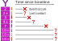
```


---
class: center, middle

# Random Survival Forests (RSFs)

---

```{r, out.width='80%', fig.align='center'}
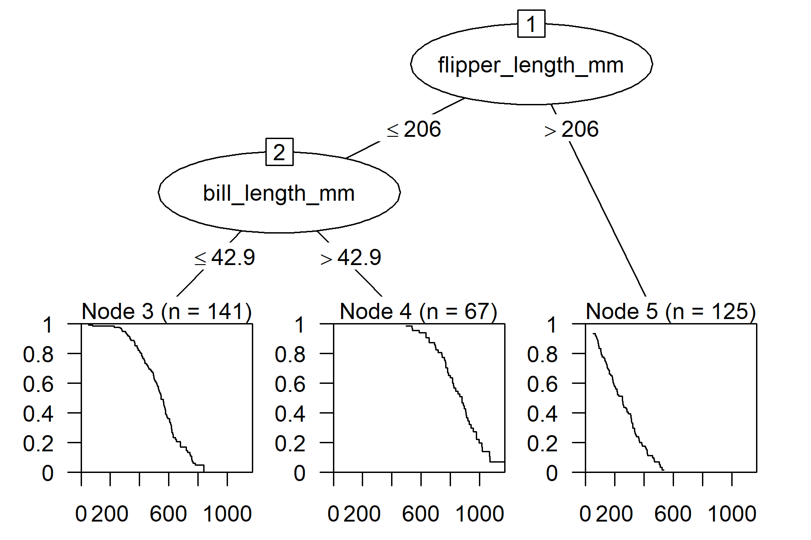
```

---

## Oblique RSFs

Around 2018, I wrote some code to fit RSFs with oblique splits.

- Published a paper to share the idea + code.<sup>1</sup>

- TLDR: Cox regression in each non-leaf node, use the regression coefficients to make oblique splits.

Around 2020, that code got picked up and used for heart failure risk prediction.<sup>2</sup>

- oblique RSF did better than boosting, penalized, and stepwise regression! 😄 

- oblique RSF was slow and hard to interpret. 😞 

.footnote[

1. Jaeger BC, Long DL, Long DM, Sims M, Szychowski JM, Min YI, Mcclure LA, Howard G, Simon N. OBLIQUE RANDOM SURVIVAL FORESTS. Ann Appl Stat. 2019 Sep;13(3):1847-1883. doi: 10.1214/19-aoas1261. Epub 2019 Oct 17. PMID: 36704751; PMCID: PMC9875945.

2. Segar MW, Jaeger BC, Patel KV, Nambi V, Ndumele CE, Correa A, Butler J, Chandra A, Ayers C, Rao S, Lewis AA, Raffield LM, Rodriguez CJ, Michos ED, Ballantyne CM, Hall ME, Mentz RJ, de Lemos JA, Pandey A. Development and Validation of Machine Learning-Based Race-Specific Models to Predict 10-Year Risk of Heart Failure: A Multicohort Analysis. Circulation. 2021 Jun 15;143(24):2370-2383. doi: 10.1161/CIRCULATIONAHA.120.053134. Epub 2021 Apr 13. PMID: 33845593; PMCID: PMC9976274.

]

---
class: center, middle
background-image: url("img/meme_slow_R.jpg")
background-size: contain

---

## Oblique RSFs

Around 2021, I committed to `aorsf`, a re-write of my oblique RSF code

- Open review by rOpenSci and published in JOSS.<sup>1</sup>

- Large benchmark and more details in pre-print.<sup>2</sup>

- Named after the software my Dad wrote while I was growing up: AORSA<sup>3</sup>

.footnote[

1. Jaeger BC, Welden S, Lenoir K, Pajewski NM. aorsf: An R package for supervised learning using the oblique random survival forest. Journal of Open Source Software. 2022 Sep 28;7(77):4705.

2. Jaeger BC, Welden S, Lenoir K, Speiser JL, Segar MW, Pandey A, Pajewski NM. Accelerated and interpretable oblique random survival forests. arXiv preprint arXiv:2208.01129. 2022 Aug 1.

3. [Article from Oak Ridge National Laboratory Cray User group featuring AORSA](https://www.laboratorynetwork.com/doc/oak-ridge-national-laboratory-speeds-tests-of-0001)

]

---
class: center, middle, inverse

# Demo with aorsf

---
layout: true

## Fit an oblique RSF

---

**Note**: Copy/paste my code and run it locally<sup>1</sup>

Step 1: install/load the `aorsf` R package


```{r, eval=FALSE, echo = TRUE}

# un-comment line below to install aorsf if needed
# install.packages('aorsf')

library(aorsf)
library(tidyverse) # will be used throughout

```


.footnote[
<sup>1</sup>Thanks to [Garrick Aden-Buie's xaringanExtra](https://github.com/gadenbuie/xaringanExtra) for this awesome feature.
]

---

Step 2: Inspect the `pbc_orsf` data

```{r, echo = TRUE, message = FALSE}

as_tibble(pbc_orsf)

```


---

Step 3: Fit and inspect your oblique RSF

```{r, echo=TRUE}

fit_orsf <- orsf(data = pbc_orsf, 
                 formula = time + status ~ . - id)

fit_orsf

```

---

Do you prefer the classic syntax?


```{r, echo=TRUE}

library(survival)

fit_cph <- coxph(formula = Surv(time, status) ~ . - id,
                 data = pbc_orsf)

```

`aorsf` supports that:

```{r, echo = TRUE}

fit_orsf <- orsf(formula = Surv(time, status) ~ . - id,
                 data = pbc_orsf)

```

Prefer pipes? `aorsf` supports that too.

```{r, echo=TRUE}

set.seed(329) # use this seed to make your results match slides

fit_orsf <- pbc_orsf |>
  orsf(formula = time + status ~ . - id)

```

---

Fan of `tidymodels`? (me too!) `aorsf` is a valid engine for censored regression.

```{r, message=FALSE, echo=TRUE}

library(parsnip)
library(censored) # must be version 0.2.0 or higher

rf_spec <- 
  rand_forest(trees = 200) %>%
  set_engine("aorsf") %>% 
  set_mode("censored regression") 

fit_tidy <- rf_spec %>% 
  parsnip::fit(data = pbc_orsf, 
               formula = Surv(time, status) ~ . - id)

# fit printed on next slide for space

```

---

Fan of `tidymodels`? (me too!) `aorsf` is a valid engine for censored regression.

```{r, echo=TRUE}
fit_tidy
```


---

layout: true

## Interpret an oblique RSF

---

Get expected risk (i.e., partial dependence [`pd`]) in descending order of importance

```{r, echo=TRUE}

orsf_summarize_uni(fit_orsf, n_variables = 1)

```

---

`orsf_pd()` functions give full control over expected risk

- `orsf_pd_inb()`: computes expected risk using all training data
- `orsf_pd_oob()`: computes expected risk using out-of-bag only
- `orsf_pd_new()`: computes expected risk using new data

```{r, echo=TRUE}

pd_oob <- orsf_pd_oob(fit_orsf, pred_spec = list(bili = 1:5))

pd_oob

```

.footnote[Why is `pred_horizon` set at 1788? If you don't set a `pred_horizon`, `orsf` functions will set it for you as the median follow-up time]


---

Use `pred_horizon` to make expected risk more interpretable.

- expected risk for men and women at 1, 2, 3, 4, and 5 years:

  ```{r, echo=TRUE}
  
  pd_by_gender <- orsf_pd_oob(fit_orsf, 
                              pred_spec = list(sex = c("m", "f")),
                              pred_horizon = 365 * 1:5)
  
  pd_by_gender %>% 
    dplyr::select(pred_horizon, sex, mean) %>% 
    tidyr::pivot_wider(names_from = sex, values_from = mean) %>% 
    dplyr::mutate(ratio = m / f)
  
  ```

Does expected risk increase faster over time for men?

---

Use `pred_horizon` to investigate expected risk profiles over time

```{r, echo=TRUE, fig.height=2.5, fig.width=8}

fit_orsf %>% 
  orsf_pd_oob(pred_spec = list(sex = c("m", "f")),
              pred_horizon = seq(365, 365*5, by = 25)) %>% 
  ggplot(aes(x = pred_horizon, y = mean, color = sex)) +
  geom_line() +
  labs(x = 'Time since baseline', y = 'Expected risk')

```


---

Or, fix `pred_horizon` and look at risk profiles over other variables

```{r, echo=TRUE}

pred_spec = list(bili = seq(1, 5, length.out = 20),
                 edema = levels(pbc_orsf$edema),
                 trt = levels(pbc_orsf$trt))

pd_bili_edema <- orsf_pd_oob(fit_orsf, pred_spec)

fig <- ggplot(pd_bili_edema) + 
  aes(x = bili, y = medn, col = trt, linetype = edema) +
  geom_line() + 
  labs(y = 'Expected predicted risk')

# fig on next slide for space

```

---

Or, fix `pred_horizon` and look at risk profiles over other variables

```{r, echo=FALSE, fig.width=7, fig.height=3}

fig

```

---
layout: false
class: center, middle

# Variable importance

---

## ANOVA importance

A fast method to compute variable importance with (some) oblique random forests:

For each predictor:

1. Compute p-values for each coefficient

1. Compute the proportion of p-values that are low (<0.01)

Importance of a predictor = the proportion of times its p-value is low.

---

## Permutation importance

For each predictor:

1. Permute predictor values

1. Measure prediction error with permuted values

Importance of a predictor = increase in prediction error after permutation

---

```{r, fig.align='center', fig.height=4, fig.width=7}
plots$forest_oblique
```

---

```{r, fig.align='center', fig.height=4, fig.width=7}
plots_x_permute$forest_oblique
```


---

## Negation importance

For each predictor:

1. Multiply coefficient in linear combination by -1

1. Measure prediction error with permuted values

Importance of a predictor = increase in prediction error after negation


---

```{r, fig.align='center', fig.height=4, fig.width=7}
plots$forest_oblique
```

---

```{r, fig.align='center', fig.height=4, fig.width=7}
plots_x_rev$forest_oblique
```

---

## Variable importance

```{r, echo=TRUE}

orsf_vi_anova(fit_orsf)[1:5]

orsf_vi_permute(fit_orsf)[1:5]

orsf_vi_negate(fit_orsf)[1:5]

```


---
layout: false
class: center, middle, inverse

# But how accurate is `aorsf`'s predicted risk?

---
layout:true

## Benchmarking `aorsf`

---

Let's run a benchmark using `mlr3`<sup>1</sup> comparing `aorsf`'s oblique RSF to:

- axis-based RSFs in `randomForestSRC`
- axis-based RSFs in `ranger`

We'll run an experiment where 

1. each approach is used to make a prediction model with the same training data
2. each model is validated in the same external data. 


Here are the packages we'll use:

```{r, echo=TRUE, message=FALSE}

library(mlr3verse)
library(mlr3proba)
library(mlr3extralearners)
library(mlr3viz)
library(mlr3benchmark)
library(OpenML) # for some of the prediction tasks

```

.footnote[<sup>1</sup>`aorsf` is compatible with `mlr3` too. Find more about `mlr3` here: https://mlr3.mlr-org.com/]

---

Retrieve some public data and set it up as a `mlr3` task object.

- Mayo Clinic Primary Biliary Cholangitis Data

  ```{r, echo = TRUE}
  
  task_pbc <- 
   TaskSurv$new(
    id = 'pbc',  
    backend = dplyr::select(pbc_orsf, -id) %>% 
     dplyr::mutate(stage = as.numeric(stage)),  
    time = "time", 
    event = "status"
   )
  
  ```

---

Retrieve some public data and set it up as a `mlr3` task object.

- Veteran's Administration Lung Cancer Trial

  ```{r, echo = TRUE}
  
  data(veteran, package = "randomForestSRC")
  
  task_veteran <- 
   TaskSurv$new(
    id = 'veteran',  
    backend = veteran,  
    time = "time", 
    event = "status"
   )
  ```

---

Retrieve some public data and set it up as a `mlr3` task object.

- NKI 70 gene signature

  ```{r, echo = TRUE}
  
  data_nki <- OpenML::getOMLDataSet(data.id = 1228)
  
  task_nki <- 
   TaskSurv$new(
    id = 'nki',  
    backend = data_nki$data,  
    time = "time", 
    event = "event"
   )
  
  ```

---

Retrieve some public data and set it up as a `mlr3` task object.

- Gene Expression-Based Survival Prediction in Lung Adenocarcinoma

  ```{r, echo = TRUE}
  
  data_lung <- OpenML::getOMLDataSet(data.id = 1245)
  
  task_lung <- 
   TaskSurv$new(
    id = 'nki',  
    backend = data_lung$data %>% 
     dplyr::mutate(OS_event = as.numeric(OS_event) -1),  
    time = "OS_years", 
    event = "OS_event"
   )
  
  ```

---

Retrieve some public data and set it up as a `mlr3` task object.

- Chemotherapy for Stage B/C colon cancer

  ```{r, echo = TRUE}
  
  # there are two rows per person, one for death 
  # and the other for recurrence, hence the two tasks
  
  task_colon_death <-
   TaskSurv$new(
    id = 'colon_death',  
    backend = survival::colon %>%
     dplyr::filter(etype == 2) %>% 
     tidyr::drop_na() %>% 
     # drop id, redundant variables
     dplyr::select(-id, -study, -node4, -etype),
     dplyr::mutate(OS_event = as.numeric(OS_event) -1),  
    time = "time", 
    event = "status"
   )
  
  ```

---

Retrieve some public data and set it up as a `mlr3` task object.

- Chemotherapy for Stage B/C colon cancer

  ```{r, echo = TRUE}
  
  # there are two rows per person, one for death 
  # and the other for recurrence, hence the two tasks
  
  task_colon_recur <-
   TaskSurv$new(
    id = 'colon_death',  
    backend = survival::colon %>%
     dplyr::filter(etype == 1) %>% 
     tidyr::drop_na() %>% 
     # drop id, redundant variables
     dplyr::select(-id, -study, -node4, -etype),
     dplyr::mutate(OS_event = as.numeric(OS_event) -1),  
    time = "time", 
    event = "status"
   )
  
  ```

---

TLDR; we have 11 different prediction tasks for this benchmark.


```{r, echo=TRUE}

# putting them all together
tasks <- list(task_pbc,
              task_veteran,
              task_nki,
              task_lung,
              task_colon_death,
              task_colon_recur,
              # add a few more pre-made ones
              tsk("actg"),
              tsk("gbcs"),
              tsk("grace"),
              tsk("unemployment"),
              tsk("whas"))

```

---

With these tasks we can run a benchmark on our favorite learners:

```{r, eval=FALSE, echo=TRUE}

# Learners with default parameters
learners <- lrns(c("surv.ranger", "surv.rfsrc", "surv.aorsf"))

# Brier (Graf) score, c-index and training time as measures
measures <- msrs(
  c("surv.graf", # Brier score (lower is better)
    "surv.cindex", # C-index (higher is better)
    "surv.calib_alpha", # Calibration slope (1 is best)
    "time_train") # time to fit model
)

# Benchmark with 5-fold CV
design <- benchmark_grid(
  tasks = tasks,
  learners = learners,
  resamplings = rsmps("cv", folds = 5)
)

benchmark_result <- benchmark(design)

bm_scores <- benchmark_result$score(measures, predict_sets = "test")
```

---


Summarize by taking the mean over all 11 tasks, and all 5 folds:

```{r, eval=FALSE,echo=TRUE}

bm_scores %>%
 select(task_id, learner_id, starts_with('surv'), time_train) %>%
 group_by(learner_id) %>% 
 filter(!is.infinite(surv.graf)) %>% 
 summarize(
  across(
   .cols = c(surv.graf, surv.cindex, surv.calib_alpha, time_train),
   .fns = mean
  )
 )

```

```{r, echo=FALSE}
read_rds('index_cache/bm_scores.rds')
```

---
layout: false
class: center, middle

# Extending aorsf

---

## Extending aorsf

`aorsf` includes a family of control functions:

- `orsf_control_cph()` uses a full Cox regression

- `orsf_control_fast()` uses partial Cox regression (default)

- `orsf_control_net()` uses penalized Cox regression (slower)

- `orsf_control_custom()` uses whatever you give it

---

## Extending aorsf

Make an oblique RSF that makes oblique splits randomly:

```{r, echo=TRUE}

f_rando <- function(x_node, y_node, w_node){
 matrix(runif(ncol(x_node)), ncol=1) 
}

fit_rando <- orsf(pbc_orsf,
                  Surv(time, status) ~ . - id,
                  control = orsf_control_custom(beta_fun = f_rando),
                  n_tree = 500)

```

---

## Extending aorsf

Make an oblique RSF that makes oblique splits with principal component analysis:

```{r, echo=TRUE}

f_pca <- function(x_node, y_node, w_node) { 
 
 # estimate two principal components.
 pca <- stats::prcomp(x_node, rank. = 2)
 # use the second principal component to split the node
 pca$rotation[, 2L, drop = FALSE]
 
}

fit_pca <- orsf(pbc_orsf,
                Surv(time, status) ~ . - id,
                control = orsf_control_custom(beta_fun = f_pca),
                n_tree = 500)

```

---

## Extending aorsf

Compare these to our initial fit:

```{r, echo=TRUE, message=FALSE}

library(riskRegression)

risk_preds <- list(dflt = 1 - fit_orsf$pred_oobag, 
                   rando = 1 - fit_rando$pred_oobag,
                   pca = 1 - fit_pca$pred_oobag)

sc <- Score(object = risk_preds, 
            formula = Surv(time, status) ~ 1, 
            data = pbc_orsf, 
            summary = 'IPA',
            times = fit_pca$pred_horizon)

```

---

## Extending aorsf

Compare these to our initial fit:

```{r}

sc$AUC

```

---

## What we covered

Fitting oblique RSFs with `aorsf`

- Similar to `coxph` syntax, usable as `tidymodels` engine and `mlr3` learner

Interpreting oblique RSFs with `aorsf`

- Partial dependence and variable importance

Benchmarking `aorsf`

- Excellent discrimination and calibration compared to axis-based RSF

- `aorsf` is computationally efficient (caveat: no parallel computing)

Extending `aorsf`

- Customize your oblique RSF with `orsf_control` functions.

---

## Acknowledgments

Research reported in this presentation was supported by 

- Center for Biomedical Informatics, Wake Forest University School of Medicine. 

- National Center for Advancing Translational Sciences (NCATS), National Institutes of Health, through Grant Award Number UL1TR001420. 

The content is solely the responsibility of the authors and does not necessarily represent the official views of the NIH.

---

background-image: url(img/orsf_collaborators.svg)
background-size: contain

